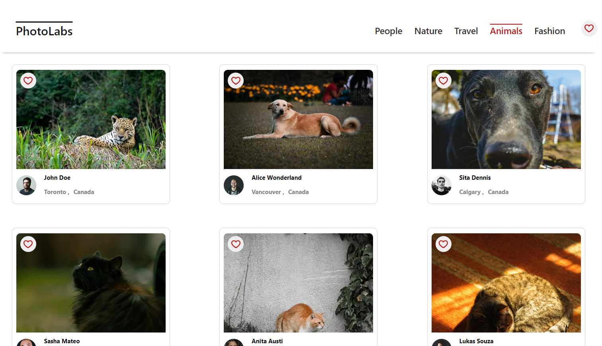
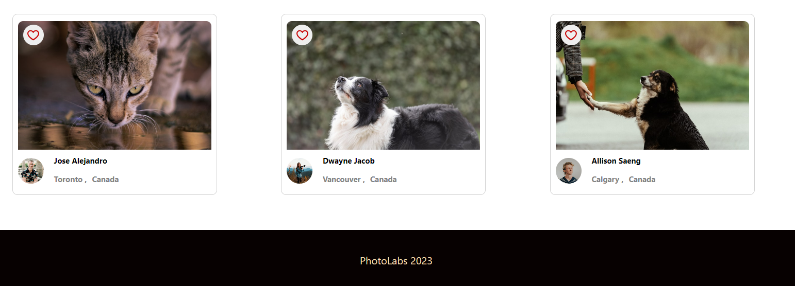
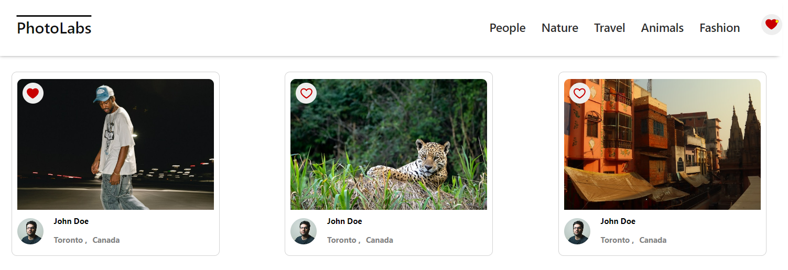
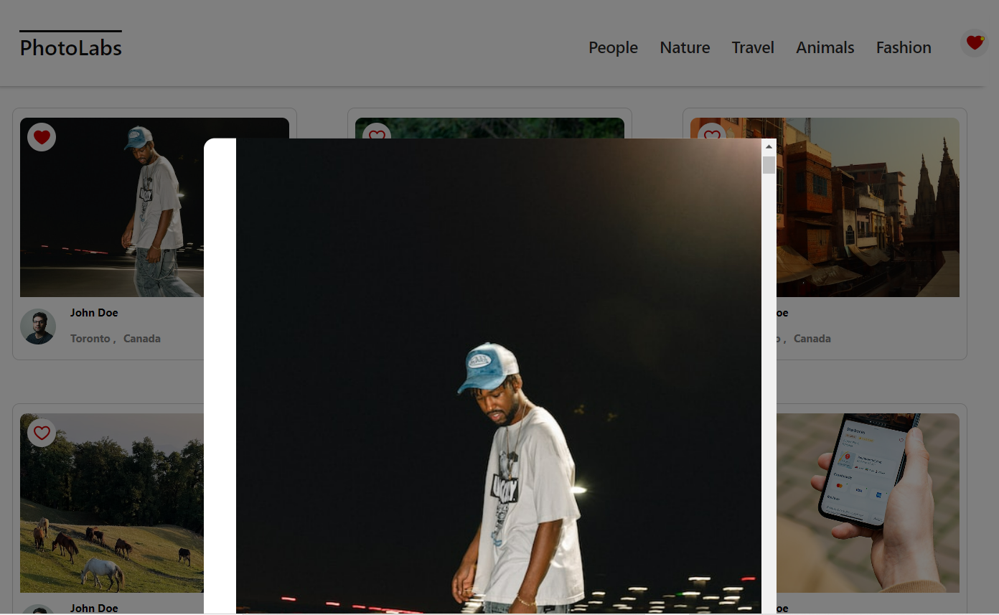

# PhotoLabs Project Documentation
The PhotoLabs project for the Web Development React course programming.
Welcome to the PhotoLabs project documentation. This document provides 
you with the necessary information to set up and run the PhotoLabs application. 
PhotoLabs is a web application built using Express for the backend and React for the frontend. 
It utilizes React Hooks and the useReducer hook for state management.







# Photolabs-Getting Started
Follow these steps to get the PhotoLabs application up and running on your local machine.

## Installation
Install dependencies for both the frontend and backend:
```sh
git clone https://github.com/your-username/photolabs.git

cd photolabs/frontend
npm install

cd ../backend
npm install

```
## Running the Development Servers
Now that you have installed the dependencies, you can start the development servers.
## [Frontend] Running Webpack Development Server

```sh
cd frontend
npm start
```
This command will launch the frontend development server, 
which you can access in your browser at http://localhost:3000.

## [Backend] Running Backend Servier
Follow the setup instructions in the readme.md file located in the backend directory 
to configure and start the backend server.
Note: Make sure to set up your database and any required environment variables 
before starting the backend server.
Read `backend/readme` for further setup details.

```sh
cd backend
npm start
```
### Frontend
The frontend of PhotoLabs is built using React and leverages the power of hooks, including the useReducer hook, 
for efficient state management. The application's UI components are structured in a modular manner for improved maintainability and reusability.

### Backend
The backend of PhotoLabs is powered by Express, a robust Node.js framework for building web applications and APIs. 
The backend handles data storage, retrieval, and processing, serving as the core of the application's functionality.

Please refer to the specific readme.md files within the frontend and backend directories for more detailed information
 on each component and any additional setup steps.

Feel free to explore the codebase, make modifications, and collaborate with your team to enhance the PhotoLabs application.

Note: This documentation is intended to provide a general overview of the setup process for the PhotoLabs project. 
Additional details and instructions may be provided in other documentation files or resources within the project.


